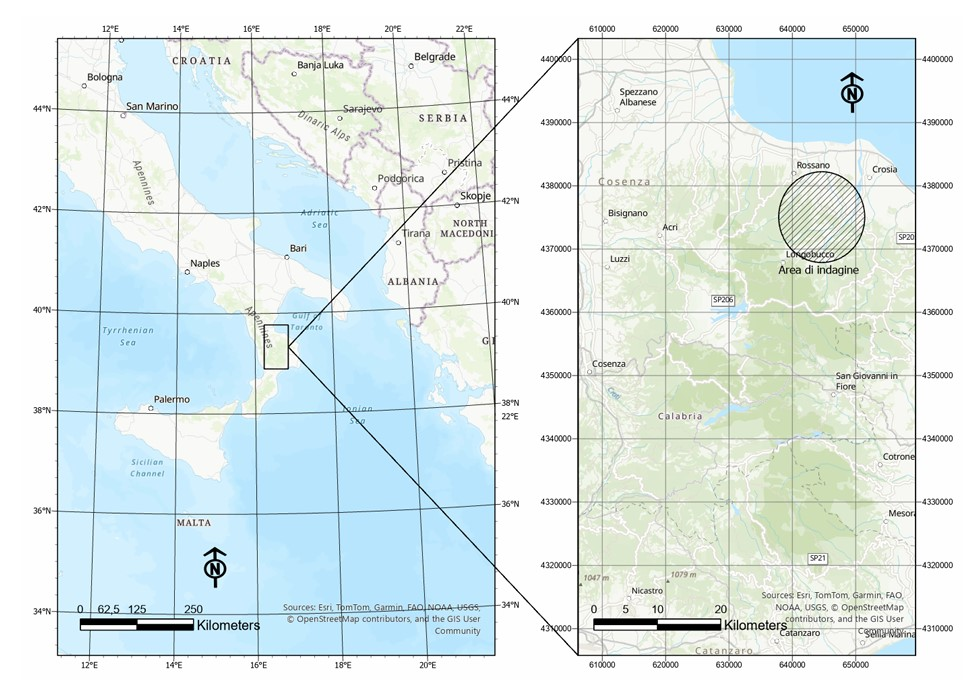
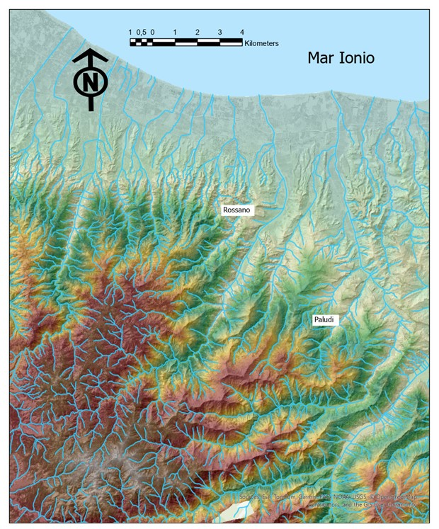
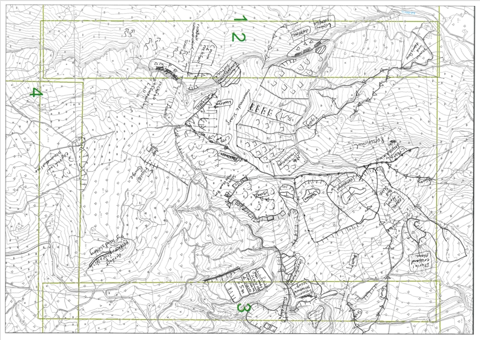
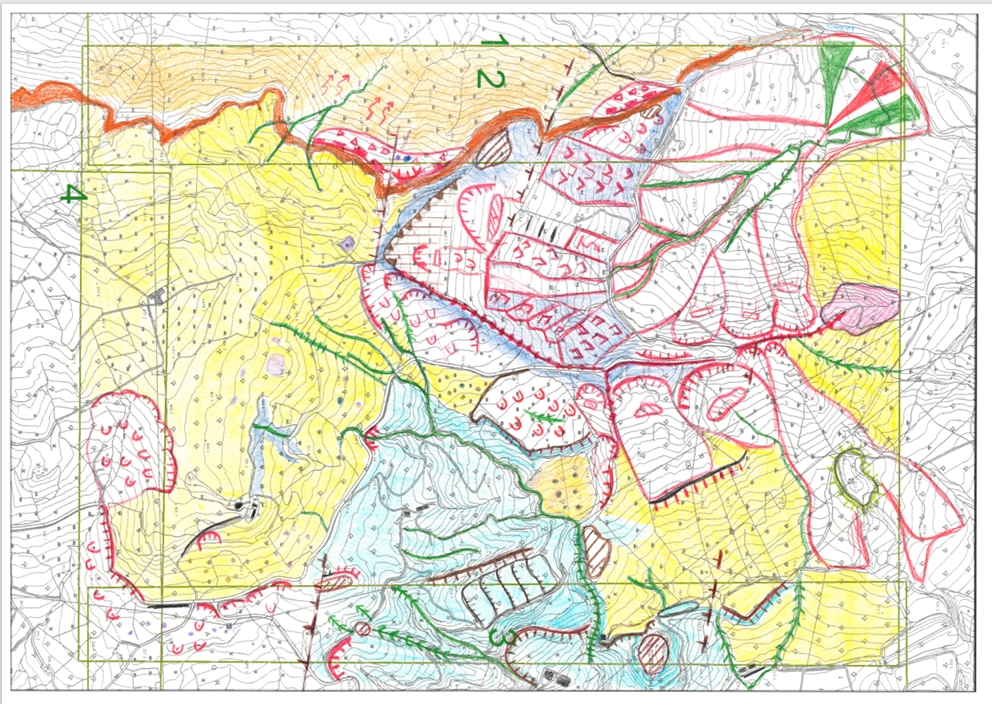
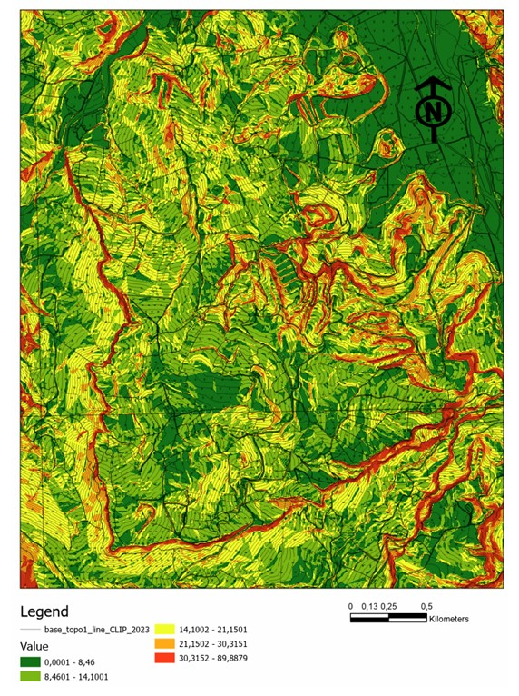
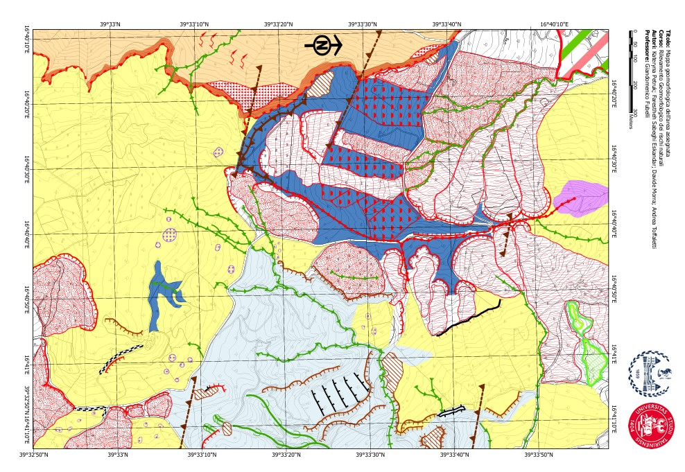
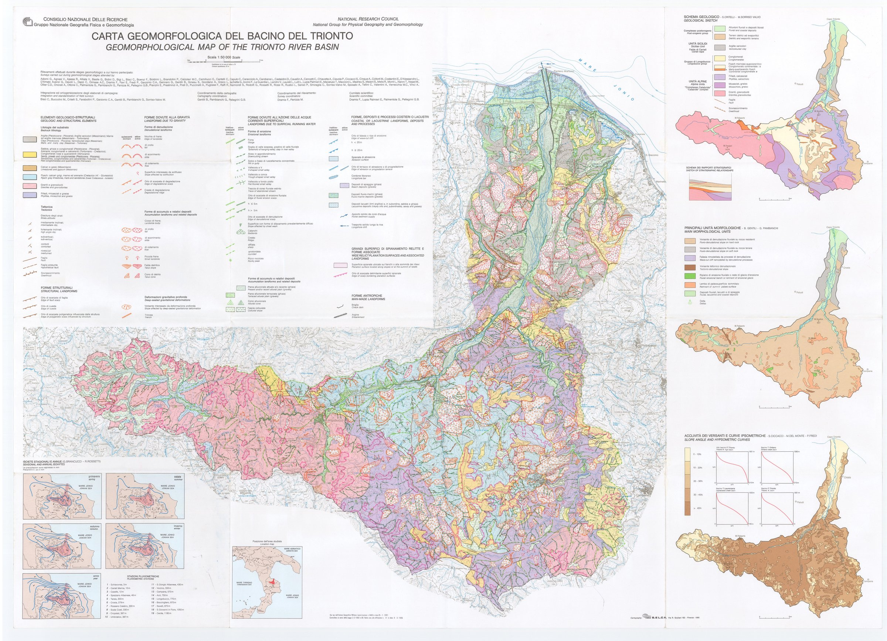

# Analisi del rischio geomorfologico — Comune di Corigliano-Rossano

**Rilevamento geomorfologico dei rischi naturali · A.A. 2024/2025**
Laurea Magistrale in Geografia e Scienze Territoriali (LM-80)
Dipartimento Interateneo di Scienze, Progetto e Politiche del Territorio
Università degli Studi di Torino / Politecnico di Torino

**Docente:** Giandomenico Fubelli
**Studenti:** Kateryna Petruk, Fareshteh Sabeghi Eskandar, Davide Morra, Andrea Toffaletti
**Data:** Giugno 2025

---

## Indice

1. [Inquadramento territoriale](#1-inquadramento-territoriale)
2. [Inquadramento geologico regionale](#2-inquadramento-geologico-regionale)
3. [Inquadramento geomorfologico](#3-inquadramento-geomorfologico)
4. [Descrizione dell'area di analisi e principali rischi rilevati](#4-descrizione-dellarea-di-analisi-e-principali-rischi-rilevati)
5. [Conclusioni](#5-conclusioni)
6. [Legenda della carta](#6-legenda-guida-alla-lettura-della-carta)
7. [Materiali del repository](#materiali-del-repository)
8. [Bibliografia](#bibliografia)

---

## 1. Inquadramento territoriale

L'area oggetto di studio è situata nel versante ionico della Calabria settentrionale, a nord-est dell'altopiano della Sila Greca, caratterizzata da un altopiano leggermente ondulato e da valli incise dai corsi d'acqua. Il territorio, esteso per circa 20 km², è compreso tra i centri abitati di **Rossano** a nord-ovest e **Paludi** a sud, ed è attraversato da vari fiumi con andamento sud-nord che sfociano nel mar Ionio: tra questi il torrente Coserie, il torrente Otturi e il fiume Trionto.

L'area si distingue per una marcata diversità paesaggistica, con un passaggio graduale da un paesaggio montuoso a sud, dominato dal Massiccio della Sila, a un paesaggio collinare e pianeggiante verso la costa ionica a nord. Il clima mediterraneo, con inverni umidi e piovosi ed estati pressoché asciutte, governa il regime delle "fiumare": corsi d'acqua quasi privi di flusso in estate ma sede di intensi fenomeni alluvionali in autunno/inverno.

<p align="center">
  
</p>

<p align="center"><em>Figura 1 — Ubicazione dell'area di studio nel contesto calabrese. L'area di indagine ricade nel settore tra Rossano e Paludi, sul versante ionico della Sila Greca.</em></p>

---

## 2. Inquadramento geologico regionale

La regione si colloca all'interno del **sistema Calabro-Peloritano**, il raccordo geologico tra la catena appenninica e le Maghrebidi. La sua formazione è iniziata nell'Eocene (~41 Ma) con la roto-traslazione del blocco corso-sardo, seguita dall'apertura del bacino tirrenico nel Miocene (~10 Ma), che ha determinato il sovrascorrimento delle unità cristalline calabridi sulle unità sedimentarie dell'avampaese africano, generando l'arco Calabro-Peloritano (Bonardi et al., 2001).

L'area di indagine ricade nel **Massiccio della Sila**, blocco settentrionale dell'arco, delimitato a nord dalla linea del Sangineto e a sud dalla linea di Catanzaro — quest'ultima responsabile del movimento differenziale della Sila rispetto al resto della Calabria.

### Stratigrafia locale (dalla più antica alla più recente)

| Formazione | Età | Caratteristiche principali |
|---|---|---|
| Basamento cristallino e granitoidi ("Unità della Sila") | Devoniano–Permiano | Filladi e graniti, fortemente alterati ("sabbione granitico") |
| Formazione di Paludi | Eocene–Miocene inf. | Conglomerati cementati con ciottoli di ofiolite |
| Flysch (pre-Serravalliano) | Pre-Serravalliano | Calcareniti/marne/argille, fortemente tettonizzate, franose |
| Conglomerato Rosso Basale | Serravalliano | Brecce clasto-sostenute, colore rosso da ossidi di ferro (fino a ~80 m) |
| Arenaceo-Conglomeratica / Arenarie a Clypeaster | Serravalliano–Tortoniano | Depositi costieri/marini con macrofauna (Clypeaster, Pecten) |
| Argilloso-Marnosa | Tortoniano | Marne, peliti, arenarie; olistostroma (fino a ~150 m) |
| Calcare di Base | Messiniano inf. | Calcilutiti e brecce carbonatiche (fino a ~35 m); genera pareti da crollo |
| Argille gessifere con olistoliti | Messiniano | Argille rimescolate con blocchi di calcare (olistoliti) |
| Molassa di Castiglione | Messiniano inf. | Conglomerati/arenarie costiere (fino a ~100 m) |
| Formazione dei Gessi | Messiniano | Gessi nodulari, areniti gessose (fino a ~100 m) |
| Formazione CTSL (*Clay with Thin Sandstone Layer*) | Pliocene–Pleistocene | Argille con sottili strati di arenaria; numerosi piani di scorrimento → frane |

> La Formazione CTSL è una nomenclatura proposta in questo studio, non ancora consolidata in letteratura, per descrivere un'unità peculiare dell'area di indagine.

---

## 3. Inquadramento geomorfologico

Il Massiccio della Sila, delimitato da faglie attive nel Quaternario, mostra un'orografia complessa con versanti ripidi e valli incise. Le paleosuperfici lungo le creste testimoniano un paesaggio antecedente al sollevamento regionale pleistocenico. Verso la costa, il reticolo idrografico assume morfologia braided con alvei larghi fino a 1 km, e sono riconoscibili fino a **cinque ordini di terrazzi marini**, prodotti dall'interazione fra cicli glaciali pleistocenici e sollevamento tettonico silano.

A sud prevalgono litologie resistenti (filladi, calcari) che generano versanti ripidi e fenomeni gravitativi come debris flow; a nord i terreni argillosi e marnosi, più erodibili, producono un paesaggio collinare dolce con reticolo idrografico ben sviluppato.

<p align="center">
  
</p>

<p align="center"><em>Figura 2 — Orografia e idrografia dell'area in esame (elaborazione ArcGIS Pro). Si noti la maggiore densità di drenaggio e l'incisione più marcata degli alvei nel settore meridionale, dove prevalgono litologie più dure.</em></p>

---

## 4. Descrizione dell'area di analisi e principali rischi rilevati

### 4.1 Rilievo geomorfologico

Il rilievo è stato eseguito nei giorni **30 aprile, 1, 2 e 3 maggio 2025**. L'area assegnata (**Area n°2**, ~5 km²) è stata percorsa per circa 30 km, indagando litologia, fenomeni e strutture geomorfologiche.

### 4.2 Analisi generale dell'area di indagine (Area n°2)

L'area si estende tra i torrenti Otturi e Coserie in zona prevalentemente collinare. Le litologie argillose conferiscono un paesaggio dolce, interrotto da morfologie più aspre dove litologie resistenti (es. Calcare di Base) creano **strutture monoclinali a cuesta**, osservabili al centro dell'area di rilievo. Queste cuesta sono tagliate da faglie normali con andamento WNW-ESE, responsabili di differenze nella tipologia di frana osservata sui due lati della linea di faglia: frane rotazionali a sud (quota più elevata), frane traslative planari a nord, queste ultime coinvolgenti direttamente la **SP 250**.

Di seguito le tavole di campo prodotte durante il rilevamento, dalla base topografica annotata sul terreno alla mappa colorata per litologia e forme:

<p align="center">
  
</p>

<p align="center"><em>Figura 3 — Base topografica utilizzata durante il rilevamento di campo, con annotazioni manoscritte su litologia, frane e strutture osservate (quadranti 1–4 dell'area n°2).</em></p>

<p align="center">
  
</p>

<p align="center"><em>Figura 4 — Trasposizione colorata della carta di campo: in giallo la Formazione delle Argille gessifere, in azzurro la Molassa di Castiglione, in arancio il Calcare di Base; le linee rosse e verdi marcano rispettivamente forme gravitative e fluviali.</em></p>

### 4.3 Caratteristiche del rilievo

L'analisi *slope* in ArcGIS Pro (DEM 5×5 m) evidenzia grandi strutture a cuesta delimitate da scarpate verticali/subverticali, specie nei versanti occidentale e meridionale. Altrove il rilievo è dolce, con pendenze che raramente superano i 21°: questo favorisce movimenti franosi di tipo **scorrimento** (planare o rotazionale) piuttosto che crolli, che restano invece concentrati ai margini delle litostrutture più resistenti.

<p align="center">
  
</p>

<p align="center"><em>Figura 5 — Inclinazione del territorio (funzione "Slope", ArcGIS Pro, DEM 5×5 m). Le fasce rosse indicano le scarpate più acclivi, concentrate ai margini delle cuesta e lungo la Molassa di Castiglione.</em></p>

### 4.4 Movimenti gravitativi di versante

Classificati secondo i criteri di **Varnes (1978)** e **Cruden & Varnes (1996)**, anche in riferimento al progetto IFFI (ISPRA):

- **Crolli** — margine occidentale della cuesta, dove il Calcare di Base perde l'appoggio delle argille marnose sottostanti; blocchi anche metrici accumulati alla base in detriti di falda conici.
- **Scorrimenti traslativi planari** — a nord della faglia centrale, favoriti dalla Formazione CTSL; coinvolgono direttamente la SP 250.
- **Scorrimenti rotazionali** — a sud della faglia, con superfici di distacco arcuate e terrazzi subpianeggianti in testa.
- **Colamenti lenti di terra (*earth flow*)** — lungo argille gessifere e Molassa di Castiglione, alimentano conoidi presso il torrente Otturi.
- **Soliflusso** — in aree pianeggianti/poco inclinate con materiali saturi.
- **Movimenti complessi** — sovrapposizione di tipologie, es. versante a nord della SP 250 (traslativo → colamento lento).

**Fattori predisponenti principali:** litologia argillosa, giacitura a franapoggio, faglie e discontinuità strutturali, condizioni geomorfologiche (pendenze, impluvi), saturazione idrogeologica post-piogge, uso agricolo del suolo (terrazzamenti, muretti a secco).

### 4.5 Stato di attività dei movimenti franosi

Il caso più critico riguarda la **SP 250**, dove un movimento gravitativo complesso coinvolge quasi l'intero versante. A monte si osservano scorrimenti traslativi planari con linee di distacco nette e rettilinee (litologia CTSL), che a valle si attenuano in colamenti lenti di terra, convergendo presso il torrente Otturi in un ampio conoide. Più a monte, oltre la linea di faglia, prevalgono movimenti rotazionali.

La sede stradale risulta **fratturata, deformata e in più tratti completamente priva di pavimentazione**, con guardrail dislocati verso valle — un caso emblematico dell'esposizione delle infrastrutture recenti a fenomeni di dissesto che i nuclei storici, costruiti su litologie più stabili, avevano storicamente evitato.

### 4.6 Soluzioni proposte

Sono distinte **opere attive** (drenaggio, consolidamento del suolo con reti/pali/tiranti, riprofilatura dei versanti, barriere paramassi) e **opere passive** (rimboschimento, controllo della vegetazione, monitoraggio strumentale).

Per il caso specifico della SP 250 si propone: regimentazione delle acque superficiali tramite canalette, muro di sostegno in gabbioni metallici al piede del versante (azione di contenimento *e* drenaggio), rivestimento antierosivo dei gully/reel con elementi prefabbricati, georeti biodegradabili e inerbimento, scogliera in pietrame alla base del versante.

---

## 5. Conclusioni

Il rilevamento ha mostrato come la **litologia** sia l'elemento fondamentale nella modellazione del paesaggio, modulata dal regime climatico — in particolare dall'intensità e distribuzione temporale delle precipitazioni, che innescano frane, colate lente, debris flow ed eventi di piena. È un territorio fragile in cui si è progressivamente persa la memoria storica degli eventi calamitosi, portando all'antropizzazione di aree un tempo evitate: i nuclei storici sorgono infatti su formazioni litologiche stabili (arenarie) in posizione elevata, mentre le infrastrutture moderne — la SP 250 ne è il caso emblematico — risultano molto più esposte al dissesto.

---

## 6. Legenda: guida alla lettura della carta

La carta geomorfologica finale (Area n°2) è organizzata per categorie genetiche: litologia, forme gravitative, forme fluviali erosive, forme tettonico-litostrutturali e forme antropiche.

<p align="center">
  
</p>

<p align="center"><em>Figura 6 — Carta geomorfologica finale dell'area assegnata (Area n°2), digitalizzata in ambiente GIS a partire dal rilievo di campo. Sistema di coordinate geografiche WGS84.</em></p>

**Principali categorie rappresentate:**

| Categoria | Elementi |
|---|---|
| **Litologia** | Formazione a CTSL · Formazione dei Gessi · Molassa di Castiglione · Argille gessifere (con/senza olistoliti) · Calcare di Base · Argilloso-Marnosa |
| **Forme gravitative — erosione** | Scarpata da crollo · Scarpata principale rotazionale/planare · Cresta di degradazione · Soliflusso |
| **Forme gravitative — deposito** | Accumulo da crollo · Accumulo da scorrimento traslativo/rotazionale · Accumulo da colamento lento (*earth flow*) · Conoide |
| **Forme fluviali erosive** | Gully/reel · Forra · Vallecola a "U" · Scarpata di erosione fluviale inattiva · Superficie di erosione fluviale non attiva |
| **Forme tettonico-litostrutturali** | Cuesta · Scarpata di erosione selettiva · Scarpata di faglia · Superficie pianeggiante di erosione |
| **Forme antropiche** | Manufatto antropico · Terrazzo antropico · Terrazzo antropico in evoluzione gravitativa |

*(Il dettaglio grafico completo dei simboli è disponibile nel report PDF originale, sezione 6.)*

---

## Materiali del repository

```
.
├── README.md
├── docs/
│   └── Elaborato_finale.pdf          # Report completo originale (con tutte le figure di campo)
└── images/
    ├── 01_study_area_location.jpg               # Inquadramento territoriale
    ├── 02_trionto_basin_geomorphological_map.jpg # Carta CNR del bacino del Trionto (1:50.000)
    ├── 03_field_survey_base_map.jpeg             # Tavola di campo — base topografica annotata
    ├── 04_field_survey_colored_map.jpeg          # Tavola di campo — colorazione litologica/morfologica
    ├── 05_final_geomorphological_map.jpg         # Carta geomorfologica finale digitalizzata (GIS)
    ├── 06_hillshade_relief_map.jpg               # Hillshade + reticolo idrografico (ArcGIS Pro)
    └── 07_slope_analysis_map.jpg                 # Carta delle pendenze (Slope, DEM 5×5 m)
```

For reference, the regional CNR geomorphological map of the wider Trionto basin (used as a background framework, not produced by this study) is also included:

<p align="center">
  
</p>

<p align="center"><em>Carta Geomorfologica del Bacino del Trionto, Consiglio Nazionale delle Ricerche — Gruppo Nazionale Geografia Fisica e Geomorfologia, scala 1:50.000. Riferimento regionale per l'inquadramento dell'area di indagine n°2.</em></p>

---

## Bibliografia

- APAT, *Atlante delle opere di sistemazione dei versanti*, Manuali e linee guida 10/2002
- Bonardi G. et al., "Rb-Sr age constraints on the Alpine metamorphic overprint in the Aspromonte Nappe", *Boll.Soc.Geol.It.*, 127(2), 2008, pp. 173–190
- Borsellini A., *Storia geologica d'Italia, Gli ultimi 200 milioni di anni*, Zanichelli, 2005
- Dramis F., Ollier C., *Genesi ed evoluzione del rilievo terrestre*, Pitagora Editrice Bologna, 2016
- Dramis F., Bisci C., *Cartografia geomorfologica*, Pitagora Editrice Bologna, 1998
- Fazio E. et al., "The Calabria-Peloritani Orogen, a composite terrane in Central Mediterranean", *Periodico di Mineralogia*, 84(3B), 2015, pp. 701–749
- Gelati R., *Storia geologica del paese Italia*, Diabasis, 2013
- Hess D., *McKnight's Geografia fisica: comprendere il paesaggio*, Piccin, 2021
- Molin P., Pazzaglia F., Dramis F., "Geomorphic expression of active tectonics in a rapidly-deforming forearc, Sila Massif, Calabria, Southern Italy", *American Journal of Science*, 304, 2004, pp. 559–589
- Ogniben L., "Le argille scagliose e i sedimenti messiniani a sinistra del Trionto (Rossano, Cosenza)", *Geol. Rom.*, 1, pp. 255–282
- Patacca E., Scandone P., "Calabria and Peloritani: Where did they stay before the Corsica-Sardinia rotation?", *Rendiconti online Soc. Geol. It.*, 15, 2011, pp. 97–101
- Perri E., "Tettonica post-tortoniana del settore nord-occidentale dell'arco calabro", *Studi Geologici Camerti*, XIV, 1996–97, pp. 155–175
- Rossetti F. et al., "Alpine structural and metamorphic signature of the Sila Piccola Massif nappe stack", *Tectonics*, 20(1), 2001, pp. 112–133
- Sorriso Valvo M., "The geomorphology of Calabria: a sketch", *Geogr. Fis. Dinam. Quat.*, 16, 1993, pp. 75–90
- Trevisan L., Giglia G., *Introduzione alla geologia*, Pacini editore, 2005

---

## License

Academic coursework produced for the *Rilevamento geomorfologico dei rischi naturali* course (A.A. 2024/2025), Università degli Studi di Torino / Politecnico di Torino. Shared for portfolio and educational purposes.
